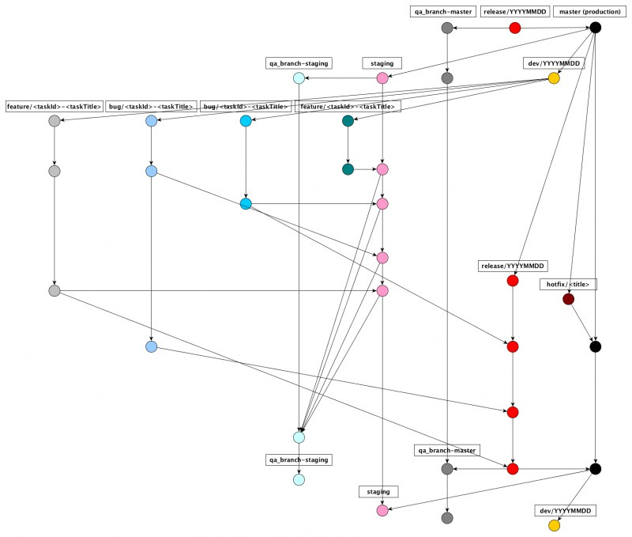

# Alicanto

<p align="center"></p>
<p align="center">
  <a href="https://jennie.sepulsa.id/view/all/job/alicanto/job/staging/">
    </img>
  </a>
</p>

* [Description](#description)
* [Installation](#installation)
* [Usage](#usage)
* [Documentation](#documentation)
* [FAQ](#faq)

## Description

Alicanto is a next version of Sepulsa's phoenix, frigate, Huggin & Munnin combined, an attempt to separate development process from Chital(Pronghorn) & reduce development process. 

## Installation
### Requirements
1. Node v10.x.x
2. [NextJs](http://nextjs.org/)
3. Docker

### Setting up environment
For a starter, simply rename `env.example` to `.env`. We can adjust this later on.
### Add DNS for development
Add following on `/etc/hosts`, you can open it using any prefered editor.
```
127.0.0.1 local.alicanto.sumpahpalapa.com
```
## Getting Started
### Clone the project
```
git clone https://github.com/sepulsa/alicanto
```

### Steps
#### Native Node.Js
This command will install dependencies.
```sh
npm install
```
#### Docker
Following commands will start the container and will build the image when not yet exists (won't build it again).
***Please make sure, that .env file has been created***
```sh
docker-compose up -d
```

## Usage
### Development
```sh
npm run dev
```
### Docker Build Apps

At this moment docker build apps only trigerred by PR.

### Deployment
Please run following commands before finishing feature / (hot)fixes.
```sh
$ npm run start
```
Alicanto will be served using express, this mode closest to staging.

You can watch staging build using jenkins [here](https://jennie.sepulsa.id/job/alicanto/job/staging/)

### Release

Release was automated using `semantic-release-bot`.

## Documentation
### git flow



Further documentation can be found on sepulsa.wiki

## FAQ

**Why Alicanto?**

Alicantos bring luck to any miner who sees them.

## License

```
Copyright 2019, Sepulsa.
```